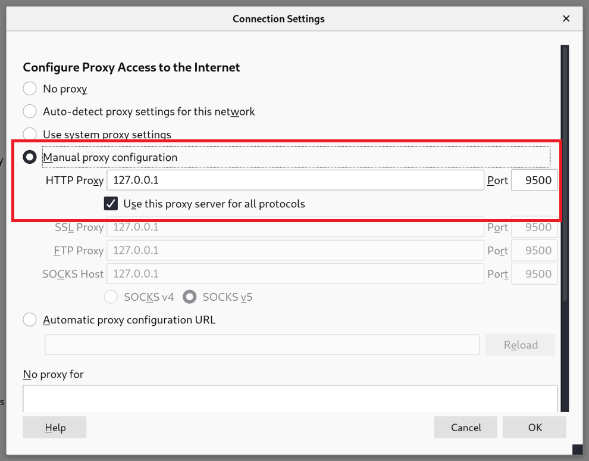

## Burp Suite with WebGoat
<ol>
    <li>Installing Burp Suite's CA Certificate for your browser (Firefox recommended)</li>
        <ul>
            <li><a href = "https://portswigger.net/burp/documentation/desktop/getting-started/proxy-setup/certificate/firefox">Firefox</a></li>
            <li><a href = "https://portswigger.net/burp/documentation/desktop/getting-started/proxy-setup/certificate/chrome">Chrome</a></li>
            <li><a href = "https://portswigger.net/burp/documentation/desktop/getting-started/proxy-setup/certificate/safari">Safari</a></li>
            <li><a href = "https://portswigger.net/burp/documentation/desktop/getting-started/proxy-setup/certificate/internet-explorer">Internet Explorer</a></li>
        </ul>
    <li>Change Proxy settings in Firefox</li>
        
    
    
</ol>
