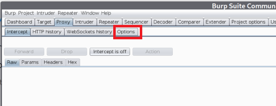
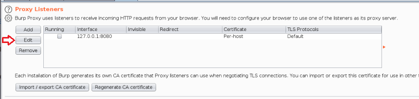
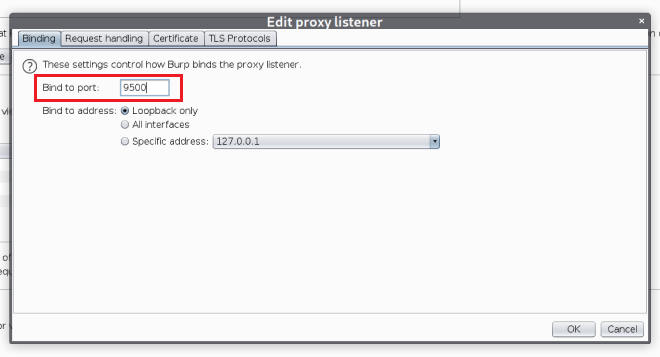
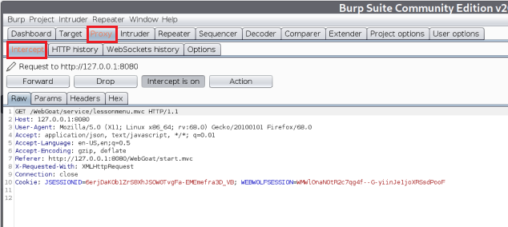

## Burp Suite with WebGoat
<ol>
    <li>Install Burp Suite's CA Certificate for your browser (Firefox recommended)</li>
        <ul>
            <li><a href = "https://portswigger.net/burp/documentation/desktop/getting-started/proxy-setup/certificate/firefox" target="_blank">Firefox</a></li>
            <li><a href = "https://portswigger.net/burp/documentation/desktop/getting-started/proxy-setup/certificate/chrome" target="_blank">Chrome</a></li>
            <li><a href = "https://portswigger.net/burp/documentation/desktop/getting-started/proxy-setup/certificate/safari" target="_blank">Safari</a></li>
            <li><a href = "https://portswigger.net/burp/documentation/desktop/getting-started/proxy-setup/certificate/internet-explorer" target="_blank">Internet Explorer</a></li>
        </ul>
    <li>Change Proxy settings in Firefox</li>
        <ol>
            <li>Firefox &rarr; Preferences &rarr; General &rarr; Network Settings</li>
            
            <li>Choose Manual Proxy Configuration and change the port number to 9500</li>
            
        </ol>
    <li>Change Proxy settings in BurpSuite</li>
        <ol>
            <li>Proxy &rarr; Options</li>
            
            <li>Proxy Listeners &rarr; Edit</li>
            
            <li>Edit the port number to be 9500</li>
            
        </ol>
    <li>Seeing the intercepted requests</li>
        
    <li>Video tutorial on Webgoat + Burpsuite + Extra Burpsuite tools</li>
        <ul><a href = "https://www.youtube.com/watch?v=KHuEspNyAsM&t=220s">Web Authentication Hacking Tutorial: Burpsuite and WebGoat</a></ul>
</ol>
